<picture>
  <source media="(prefers-color-scheme: dark)" srcset="assets/header-dark.svg">
  
</picture>

  
  
  

---

## 🧠 En deux lignes

Étudiant en **informatique et systèmes réseaux**. Ce qui m'intéresse, c'est comment les choses
tiennent debout : une pile réseau, une position d'échecs, un circuit sur breadboard, un empire romain.
Même curiosité, échelles différentes.

Je code surtout en Python et en JavaScript, je casse régulièrement mon Linux, et je perds
des parties de blitz à des heures indécentes.

<b>🔬 Ce sur quoi je traîne quand personne ne me surveille</b>

 

| Domaine | Ce qui m'attire dedans |
|---|---|
| 🌐 **Réseaux & systèmes** | Comprendre le chemin exact d'un paquet, de la carte réseau jusqu'à l'appli |
| ⚙️ **Électronique & DIY** | Arduino, ESP32, ambilight, tout ce qui clignote pour une bonne raison |
| 🤖 **IA / ML** | Moins la hype que la question « qu'est-ce que ce modèle a réellement appris ? » |
| ♟️ **Échecs** | Le seul domaine où je peux mesurer objectivement ma progression |
| 📜 **Histoire** | Parce que la plupart des débats actuels sont des redites, et le savoir fait gagner du temps |
| 🧪 **Sciences** | Neurosciences en tête — l'interface cerveau/machine reste le sujet le plus fou du moment |

<b>🛠️ Ma stack (celle que j'utilise vraiment)</b>

 

---

## 📦 Mes projets

<table>
  <tr>
    <td width="50%">
      <a href="https://github.com/ByteOneDev/Cinecrique">
        <picture>
          <source media="(prefers-color-scheme: dark)" srcset="assets/repo-cinecrique-dark.svg">
          
        </picture>
      </a>
    </td>
    <td width="50%">
      <a href="https://github.com/ByteOneDev/TRI-FI_V1">
        <picture>
          <source media="(prefers-color-scheme: dark)" srcset="assets/repo-tri-fi-v1-dark.svg">
          
        </picture>
      </a>
    </td>
  </tr>
  <tr>
    <td width="50%">
      <a href="https://github.com/ByteOneDev/Bot-discord">
        <picture>
          <source media="(prefers-color-scheme: dark)" srcset="assets/repo-bot-discord-dark.svg">
          
        </picture>
      </a>
    </td>
    <td width="50%">
      <a href="https://github.com/ByteOneDev/design-system">
        <picture>
          <source media="(prefers-color-scheme: dark)" srcset="assets/repo-design-system-dark.svg">
          
        </picture>
      </a>
    </td>
  </tr>
</table>

<i>Ces cartes sont générées toutes les 6 h par une Action maison — description, langage et étoiles sont toujours à jour.</i>

---

## ♟️ Échecs — en direct

<picture>
  <source media="(prefers-color-scheme: dark)" srcset="assets/chess-dark.svg">
  
</picture>

Ratings récupérés directement sur l'API Lichess par une GitHub Action, sans service tiers. Le code tient dans <a href="scripts/build_widgets.py"><code>scripts/build_widgets.py</code></a>.

---

## 📊 Statistiques GitHub

  
  

  

---

## 🐍 Le serpent mange mes contributions

<picture>
  <source media="(prefers-color-scheme: dark)" srcset="https://raw.githubusercontent.com/ByteOneDev/ByteOneDev/output/snake-dark.svg">
  
</picture>

---

## 🤝 On se parle ?

Que ce soit pour un projet, une question technique, une partie d'échecs ou un débat historique
qui déraille : ma boîte mail est ouverte.

- 🌐 **Site** — [matt0967.github.io](https://matt0967.github.io/)
- 📫 **Mail** — [perezmatthieu1@gmail.com](mailto:perezmatthieu1@gmail.com)
- ♟️ **Lichess** — [@matt0967](https://lichess.org/@/matt0967)

 

  <i>« On ne comprend vraiment un système que le jour où on l'a cassé soi-même. »</i>

  

